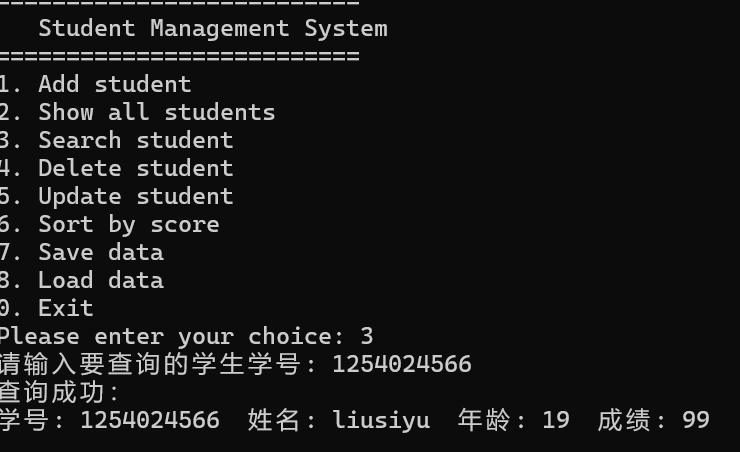
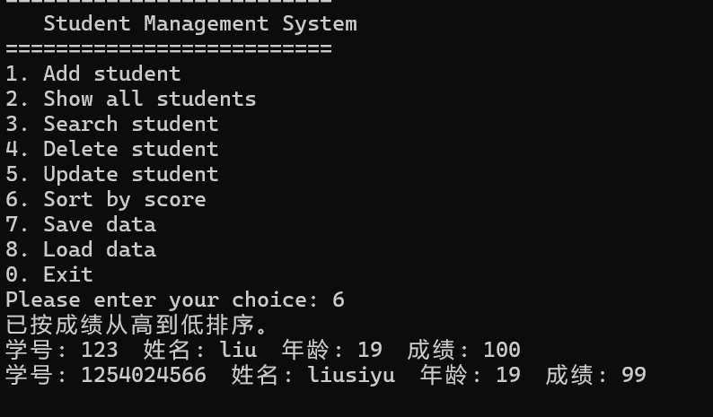
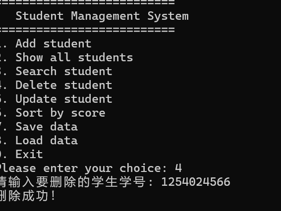

# student-management-system.cpp
A C++ student management system based on OOP and file persistence
# Student Management System C++

一、项目简介

本项目是一个基于 C++ 面向对象程序设计实现的学生信息管理系统，主要用于练习类与对象、封装、STL 容器、文件读写、排序算法和输入合法性检查等基础能力。
项目支持学生信息的添加、查询、删除、修改、成绩排序、文件保存与读取等功能，适合作为 C++ 面向对象程序设计课程练习项目。


二、技术栈
C++,面向对象程序设计,STL vector,fstream 文件读写

 三、核心功能
添加学生信息，查看所有学生，按学号查询学生，删除学生信息，修改学生信息，按成绩从高到低排序，保存学生信息到文件，从文件读取学生信息，学号重复检查，年龄与成绩合法性检查，项目结构
四、项目结构
```text
学生管理系统.cpp
├── README.md
├── src
│   └── main.cpp
├── data
│   └── students.txt
└── docs
    └── 项目说明.md

项目截图

 查看所有学生


 查询学生



 成绩排序



 删除学生



 添加学生

